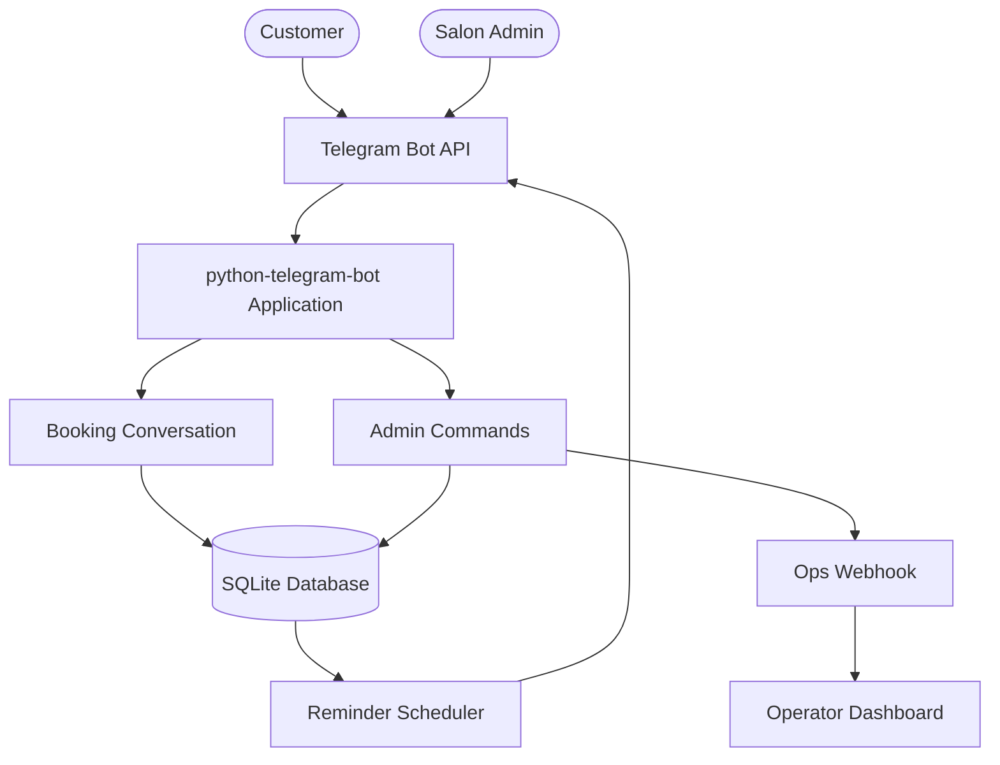

# Telegram Salon Bot

[](https://www.python.org/)
[](https://core.telegram.org/bots/api)
[](https://www.sqlite.org/)
[](https://www.freedesktop.org/software/systemd/man/latest/systemd.service.html)
[](https://en.wikipedia.org/wiki/Time_in_Slovakia)

Appointment booking bot for Salón Kráľovná. Customers book stylist appointments through a Telegram conversation flow, while salon admins receive daily summaries, cancellations, reminders, and operational webhook events.

## Overview

Telegram Salon Bot is designed as a small production-ready service for a salon appointment workflow. It keeps the user experience inside Telegram, stores bookings locally in SQLite, and uses an in-process scheduler for reminder delivery.

The project focuses on:

- Fast booking through inline Telegram keyboards.
- Clear admin commands for daily salon operations.
- Local-first persistence with SQLite.
- Simple deployment on an Ubuntu server with systemd.
- Optional webhook integration for an external operations dashboard.

## Features

| Feature | Details |
| --- | --- |
| Booking flow | Inline keyboard conversation for stylist, date, time, and confirmation. |
| Stylist selection | Two stylists with profile photos. |
| Admin commands | Daily bookings, period statistics, and admin-side cancellation. |
| Reminders | Telegram reminders 24 hours and 2 hours before an appointment. |
| Timezone handling | Defaults to `Europe/Bratislava` and respects salon business hours. |
| Booking buffer | Configurable gap between appointments, defaulting to 15 minutes. |
| Ops webhook | Sends booking events to an external dashboard when configured. |

## System design



### Runtime flow

| Step | Component | Responsibility |
| --- | --- | --- |
| 1 | Telegram Bot API | Receives customer and admin interactions. |
| 2 | `python-telegram-bot` | Routes commands, callbacks, and conversation states. |
| 3 | Booking handlers | Validate choices and create appointment records. |
| 4 | SQLite | Stores appointments, stylists, clients, and reminder state. |
| 5 | Reminder scheduler | Checks upcoming appointments and sends reminder messages. |
| 6 | Ops webhook | Optionally mirrors booking events to an external dashboard. |

## Tech stack

| Layer | Choice | Notes |
| --- | --- | --- |
| Runtime | Python 3.11+ | Main application runtime. |
| Bot framework | `python-telegram-bot` v21.x | Command handlers, callbacks, and conversation flow. |
| Database | SQLite | Single-file local database, no external server required. |
| Async database access | `aiosqlite` | Async SQLite calls for bot workflows. |
| Configuration | `python-dotenv` | Loads local `.env` settings. |
| Scheduling | Job queue / asyncio loop | Runs reminder checks every 15 minutes. |
| Deployment | systemd on Ubuntu | Long-running service with restart behavior. |

## Bot commands

| Command | Audience | Purpose |
| --- | --- | --- |
| `/start` | Customers and admins | Opens the main bot menu. |
| `/today` | Admin | Shows appointments scheduled for today. |
| `/stats` | Admin | Shows booking statistics. |
| `/admin_cancel` | Admin | Cancels an existing booking from the admin side. |

## Quick start

Clone the repository and create a virtual environment:

```bash
git clone https://github.com/brusnyak/telegram-salon-bot.git
cd telegram-salon-bot
python3 -m venv .venv
source .venv/bin/activate
```

Install dependencies:

```bash
pip install -r requirements.txt
```

Create your environment file:

```bash
cp .env.example .env
```

Set the required values in `.env`:

```env
TELEGRAM_BOT_TOKEN=your-bot-token
ADMIN_CHAT_ID=your-telegram-user-id
BOT_OPS_WEBHOOK_URL=http://127.0.0.1:4317/webhooks/telegram
```

Run the bot locally:

```bash
python -m main
```

## Environment variables

| Variable | Required | Default | Description |
| --- | --- | --- | --- |
| `TELEGRAM_BOT_TOKEN` | Yes | None | Bot token from `@BotFather`. |
| `ADMIN_CHAT_ID` | Yes | `0` | Telegram user ID allowed to use admin commands. |
| `BOT_OPS_WEBHOOK_URL` | No | None | Optional webhook URL for external operational monitoring. |
| `SALON_TIMEZONE` | No | `Europe/Bratislava` | Salon timezone used for booking and reminders. |
| `BOOKING_BUFFER_MIN` | No | `15` | Buffer between appointments in minutes. |

## Production deployment

The repository includes a systemd service file for Ubuntu-style deployment.

```bash
sudo cp deploy/salon-bot.service /etc/systemd/system/
sudo systemctl daemon-reload
sudo systemctl enable --now salon-bot
```

Useful service commands:

```bash
sudo systemctl status salon-bot
sudo journalctl -u salon-bot -f
sudo systemctl restart salon-bot
```

Before deploying, confirm the paths inside `deploy/salon-bot.service` match your server directory.

## Project structure

```text
telegram-salon-bot/
├── main.py              # Entry point and Telegram application builder
├── config.py            # Environment-based configuration
├── reminders.py         # Appointment reminder scheduler
├── ops_webhook.py       # External dashboard event posting
├── handlers/
│   ├── start.py         # /start and menu callbacks
│   ├── booking.py       # Booking conversation flow
│   ├── admin.py         # Admin commands
│   └── common.py        # Shared formatters and validators
├── db/
│   ├── db.py            # SQLite connection and queries
│   └── schema.sql       # Database schema
├── assets/              # Stylist profile photos
└── deploy/              # systemd service file
```

## README style direction

This repository uses a clean portfolio README structure:

- Short product description at the top.
- Technology labels for fast scanning.
- Feature and command tables for structured reading.
- System design diagram when architecture is useful.
- Practical setup, configuration, and deployment sections.

This format is intended to be reusable across related repositories while still leaving room for project-specific architecture diagrams.

## License

No license file is currently included in this repository.
