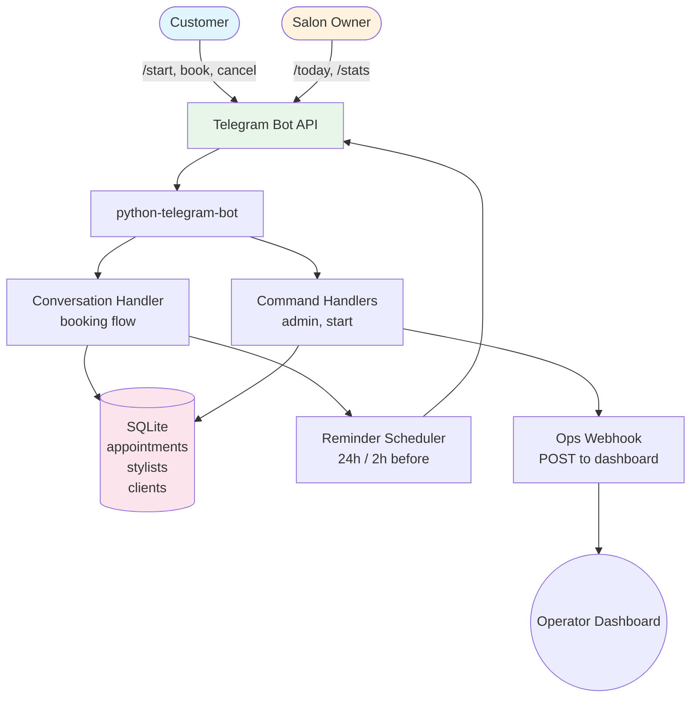

# Telegram Salon Bot

Appointment booking bot for Salón Kráľovná. Customers book stylist appointments through a Telegram conversation flow. Admins get daily summaries, cancellations, and operational webhooks.

## Architecture



## Tech Stack

- **Runtime:** Python 3.11+
- **Framework:** python-telegram-bot (v21.x)
- **Database:** SQLite (single-file, no external DB server)
- **Scheduling:** asyncio-based in-process reminder loop
- **Deploy:** systemd service on Ubuntu

## Features

| Feature | Details |
|---------|---------|
| Booking flow | Inline keyboard conversation — select stylist, date, time, confirm |
| Stylist selection | 2 stylists with profile photos |
| Admin commands | `/today` — bookings today, `/stats` — period summary, `/cancel` — cancel booking |
| Reminders | 24h and 2h before appointment via Telegram |
| Timezone aware | Europe/Bratislava, respects business hours |
| Ops webhook | Posts booking events to external dashboard |
| Booking buffer | Configurable gap between appointments (default 15 min) |

## Setup

```bash
# 1. Clone and install
git clone <repo-url>
cd telegram-salon-bot
python3 -m venv .venv
source .venv/bin/activate
pip install -r requirements.txt

# 2. Configure
cp .env.example .env
# Set TELEGRAM_BOT_TOKEN, ADMIN_CHAT_ID, BOT_OPS_WEBHOOK_URL (optional)

# 3. Run
python -m main
```

### Production (systemd)

```bash
sudo cp deploy/salon-bot.service /etc/systemd/system/
sudo systemctl daemon-reload
sudo systemctl enable --now salon-bot
```

## Environment Variables

| Variable | Required | Description |
|----------|----------|-------------|
| `TELEGRAM_BOT_TOKEN` | Yes | Bot token from @BotFather |
| `ADMIN_CHAT_ID` | Yes | Telegram user ID for admin commands |
| `BOT_OPS_WEBHOOK_URL` | No | Ops dashboard webhook for cross-platform monitoring |
| `SALON_TIMEZONE` | No | Default: Europe/Bratislava |
| `BOOKING_BUFFER_MIN` | No | Buffer between bookings, default: 15 |

## Project Structure

```
telegram-salon-bot/
├── main.py              # Entry point, app builder
├── config.py            # Config from env vars
├── reminders.py         # Appointment reminder loop
├── ops_webhook.py       # Dashboard event posting
├── handlers/
│   ├── start.py         # /start, menu callback
│   ├── booking.py       # Booking conversation flow
│   ├── admin.py         # /today, /stats, /cancel
│   └── common.py        # Shared formatters, validators
├── db/
│   ├── db.py            # SQLite connection, queries
│   └── schema.sql       # Table definitions
├── assets/              # Stylist profile photos
└── deploy/              # systemd service file
```
